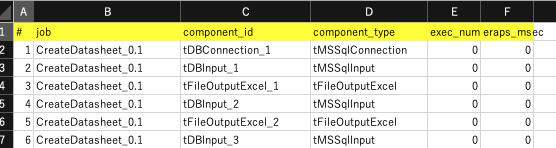

# talendtools
Talend Studioで作成されたジョブ（.itemファイル）から使用されているコンポーネントを抽出し、Excelファイルに出力するツールです。
試験的な機能として、統計ファイルから実行されたコンポーネントと実行時間を追加することも可能です。

## Environment
- JVM: jdk11
- gradle: 7.5

## Prepare
Download this project.
### build
```
talendtools$ ./gradlew shadowJar
```
### Move jar to your work
```
talendtools$ cp app/build/libs/app-all.jar ~/mywork 
```
### Test run show help
```
talendtools$ cd ~/mywork 
mywork$ java -jar app-all.jar -h
usage: [opts]
 -h,--help                 help
 -o,--outputDir <arg>      output_directory
 -out_components           output [project].xlsx and [project].txt
 -out_connections          output [db_connection.item].dat
 -out_ddl                  output create_[db_connection.item].sql
 -p,--projectName <arg>    talend_project_name
 -s,--statFilePath <arg>   stat_file_path
 -show                     show to concole
 -t,--targetType <arg>     targetType ( component | db_chema )
 -w,--workspaceDir <arg>   talend_workspace_directory
```
### Create properties file
```
mywork$ vi TlBuilder.properties
```
contents of file ( sample )
```
DEFAULT_WORKSPACE_DIR=/Applications/TalendStudio-8.0.1/studio/workspace (workspace of Talend Studio)
DEFAULT_PROJECT_NAME=SAMPLE (Project name)
DEFAULT_OUTPUT_DIR=.
```
## Run
```
mywork$ java -jar app-all.jar
```
### Output console ( param: -show)
```
project: EXAMPLE
	job: ComponentRow_0.1
	jobFileName: src/test/resources/testNormal/EXAMPLE/process/t01_Compo/Databases/ComponentRow_0.1.item
		id: tCreateTable_1  type: tCreateTable
		id: tMysqlOutput_1  type: tMysqlOutput
		id: tMysqlRow_1  type: tMysqlRow
		id: tMysqlRow_2  type: tMysqlRow
		id: tRowGenerator_1  type: tRowGenerator
	job: Connection_0.1
```
### Output components excel file ( param: -out_components)


### Output db schema file ( param: -out_connections )
```
connections
	itemFile: mssql_0.1.item, name: mssql
		tableName: allcol_tbl, tableType: TABLE, schemaName: dbo
			columnName: col1, type: INT, length: 10
			columnName: col2, type: BIT, length: 1
			columnName: col3, type: DECIMAL, length: 18
			columnName: col4, type: MONEY, length: 19

```
### Ourput create table sql file ( param: -out_ddl)
```
CREATE TABLE [dbo].[allcol_tbl](
	[col1] [INT] NOT NULL,
	[col2] [BIT] NULL,
	[col3] [DECIMAL](18, 0) NULL,
```

## 参考機能
### STATS FILE（統計情報）について
Talend Studioにて各コンポーネントの詳細設定の統計情報出力をチェックすることでコンポーネントごとの実行の開始／終了を統計情報ファイルに出力することが可能です。ただし、各コンポーネントごとに手動で行う必要があります。
この統計情報ファイルを読み込ませることにより、実行されたかどうか及び実行時間がわかります。
このプログラムでは実行された回数と実行時間の累積をコンポーネントごとに集計します。
